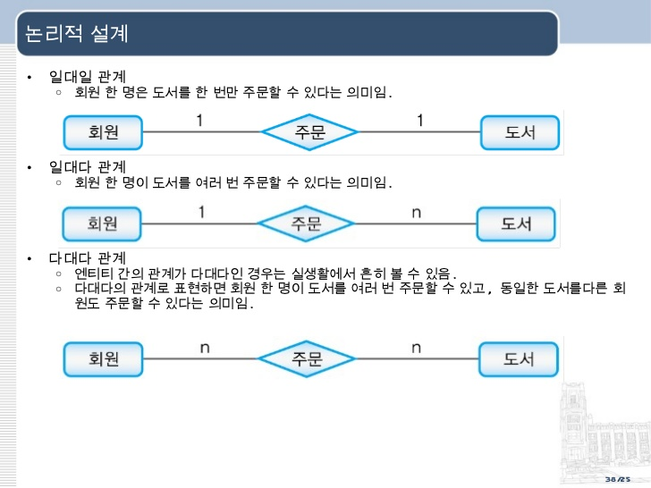

- [SQL로 하는 데이터 분석](#sql로-하는-데이터-분석)
- [1. 데이터 조회하기](#1-데이터-조회하기)
  - [1.1 select 문](#11-select-문)
  - [1.2 문자열 매칭 조건식](#12-문자열-매칭-조건식)
  - [1.3 추가 조건표현식](#13-추가-조건표현식)
  - [1.4 DATE type 관련 함수](#14-date-type-관련-함수)
  - [1.5 여러개의 조건 걸기](#15-여러개의-조건-걸기)
  - [1.6 이스케이핑 문제](#16-이스케이핑-문제)
  - [1.7 정렬하기](#17-정렬하기)
  - [1.8 정렬 시 주의할 점](#18-정렬-시-주의할-점)
  - [1.9 데이터 일부만 추리기 : limit](#19-데이터-일부만-추리기--limit)
- [2. 데이터 분석 단계로 나아가기](#2-데이터-분석-단계로-나아가기)
  - [2.1 데이터 특성 구하기](#21-데이터-특성-구하기)
  - [2.2 집계함수와 산술함수](#22-집계함수와-산술함수)
  - [2.3 NULL을 다루는 방법](#23-null을-다루는-방법)
  - [2.5 이상치 다루기](#25-이상치-다루기)
  - [2.6 컬럼끼리 계산하기](#26-컬럼끼리-계산하기)
  - [2.7 alias 붙이기](#27-alias-붙이기)
  - [2.8 컬럼끼리 계산하기](#28-컬럼끼리-계산하기)
  - [2.9 CASE함수 종류](#29-case함수-종류)
  - [2.10 null 변환함수](#210-null-변환함수)
  - [2.11 고유값만 보기](#211-고유값만-보기)
  - [2.12 문자열 관련 함수](#212-문자열-관련-함수)
  - [2.13 그루핑해서 보기](#213-그루핑해서-보기)
  - [2.14 group by의 규칙](#214-group-by의-규칙)
  - [2.15 ROLL UP](#215-roll-up)
  - [2.16 with rollup의 계층구조와 grouping 함수](#216-with-rollup의-계층구조와-grouping-함수)
- [3.테이블 조인 활용](#3테이블-조인-활용)
  - [3.1 foreign key 설정하기](#31-foreign-key-설정하기)
  - [3.2 서로다른 테이블 조인하기(left/right outer join)](#32-서로다른-테이블-조인하기leftright-outer-join)
  - [3.3 조인할 때 테이블에 alias 붙이기](#33-조인할-때-테이블에-alias-붙이기)
  - [3.4 다른 종류의 테이블 조인하기(inner join)](#34-다른-종류의-테이블-조인하기inner-join)
  - [3.5 집합연산](#35-집합연산)
  - [3.6 같은 종류의 테이블 조인하기](#36-같은-종류의-테이블-조인하기)
  - [3.7 서로 다른 3개의 테이블 조인하기](#37-서로-다른-3개의-테이블-조인하기)
  - [3.8 1대1, 1대n, n대m 관계의 이해](#38-1대1-1대n-n대m-관계의-이해)
      - [1:1 관계](#11-관계)
      - [1:N 관계(일대다 관계)](#1n-관계일대다-관계)
      - [N:M 관계(다대다 관계)](#nm-관계다대다-관계)
  - [3.9 의미있는 데이터 추출하기](#39-의미있는-데이터-추출하기)
  - [3.10 natural join,cross join,self join, full outer join, non equi join](#310-natural-joincross-joinself-join-full-outer-join-non-equi-join)
    - [natural join](#natural-join)
    - [cross join](#cross-join)
    - [self join](#self-join)
    - [full outer join](#full-outer-join)
    - [non equi join](#non-equi-join)
- [4.서브쿼리와 View를 활용한 데이터분석](#4서브쿼리와-view를-활용한-데이터분석)
  - [4.1 서브쿼리를 활용한 데이터 분석](#41-서브쿼리를-활용한-데이터-분석)
  - [4.2 select 절의 서브쿼리 : 보통 새로운 컬럼 추가를 의미, 원래 컬럼에 없던 컬럼 추가](#42-select-절의-서브쿼리--보통-새로운-컬럼-추가를-의미-원래-컬럼에-없던-컬럼-추가)
  - [4.3 where 절의 서브쿼리 : '특정조건을 만족하는..' 에서 특정 조건을 담당함](#43-where-절의-서브쿼리--특정조건을-만족하는-에서-특정-조건을-담당함)
  - [4.4 where 절의 서브쿼리(2) : 여러 값을 리턴하는 서브쿼리](#44-where-절의-서브쿼리2--여러-값을-리턴하는-서브쿼리)
  - [4.5 ANY(SOME),ALL](#45-anysomeall)
      - [ANY](#any)
      - [ALL](#all)
  - [4.6 서브쿼리 예제](#46-서브쿼리-예제)
  - [4.7 FROM 절에 있는 서브쿼리(테이블형태의 결과를 리턴하는 서브쿼리)](#47-from-절에-있는-서브쿼리테이블형태의-결과를-리턴하는-서브쿼리)
    - [SQL예제와 서브쿼리](#sql예제와-서브쿼리)
  - [4.8 서브쿼리의 종류 정리](#48-서브쿼리의-종류-정리)
  - [4.9 상관서브쿼리와 비상관서브쿼리](#49-상관서브쿼리와-비상관서브쿼리)
    - [exixts가 없는 상관서브쿼리](#exixts가-없는-상관서브쿼리)
  - [6.16 서브쿼리 중첩과 문제점 : 쿼리가 너무 길어지는 문제](#616-서브쿼리-중첩과-문제점--쿼리가-너무-길어지는-문제)
  - [서브쿼리 총정리](#서브쿼리-총정리)
  - [6.17 데이터 분석가의 자산, 뷰](#617-데이터-분석가의-자산-뷰)
  - [별점평균 가장높은 id](#별점평균-가장높은-id)
  - [6.19 실무에서 첫번째로 해야할 일](#619-실무에서-첫번째로-해야할-일)
  - [추가적인 학습사항(계속 업데이트)](#추가적인-학습사항계속-업데이트)
    - [NULLIF 함수 사용하기](#nullif-함수-사용하기)
      - [empty string을 NULL로 보여주는 쿼리](#empty-string을-null로-보여주는-쿼리)
      - [empty string을 NULL로 만드는 쿼리](#empty-string을-null로-만드는-쿼리)
# SQL로 하는 데이터 분석

# 1. 데이터 조회하기
## 1.1 select 문
> SELECT * FROM `member`;

```sql

SELECT * FROM `MEMBER`  WHERE AGE >= 27; # 27세 이상 조회

SELECT * FROM MEMBER WHERE AGE BETWEEN 30 AND 39; # 30대 조회

SELECT * FROM MEMBER WHERE AGE NOT BETWEEN  30 AND 39; # 30대 제외 조회

SELECT * FROM MEMBER WHERE SIGN_UP_DAY > '2019-01-01'; # 2019년 1월 1일 이후로 가입한 회원 조회

SELECT  * FROM `member` WHERE SIGN_UP_DAY BETWEEN '2018-01-01' AND '2018-12-31'; # 2018년 내 가입자 조회
```

## 1.2 문자열 매칭 조건식

```sql
SELECT * FROM copang_main.`member` WHERE address like '서울%'; # address가 서울로 시작하는 row 조회

SELECT * FROM copang_main.`member` WHERE address like '%고양시%'; # 고양시라는 단어 앞뒤로 임의의 길이를 가진 문자열 조건
```

## 1.3 추가 조건표현식

```sql
SELECT * FROM copang_main.`member` WHERE gender != 'm'; # 남성 제외

SELECT * FROM copang_main.`member` WHERE age IN (20,30); # IN은 범위 제한을 나타냄

SELECT * FROM copang_main.`member` WHERE email like 'c_____@%';
```

## 1.4 DATE type 관련 함수
```sql
SELECT * FROM copang_main.`member` WHERE year(birthday) = 1992; # year() : 날짜에서 연도 반환

SELECT * FROM copang_main.`member` WHERE MONTH (birthday) IN (6,7,8); # month() : 날짜에서 월 반환

SELECT * FROM copang_main.`member` WHERE DAYOFMONTH(birthday) BETWEEN  15 and 31; # date : 날짜에서 date 반환

SELECT email,sign_up_day,DATEDIFF(sign_up_day,'2019-01-01') FROM `member` ; # 각 회원이 가입한 날짜가 19년 1월 1일 이후 몇일인가?

SELECT email,sign_up_day,DATE_ADD(sign_up_day,INTERVAL 300 day) FROM `member` ; # 날짜 더하기

SELECT email,sign_up_day,DATE_SUB(sign_up_day,INTERVAL 300 day) FROM `member` ; # 날짜 빼기

SELECT email,sign_up_day,UNIX_TIMESTAMP(sign_up_day) FROM `member`; # unix_timestamp 변환
```

## 1.5 여러개의 조건 걸기

```sql
SELECT * from copang_main.`member` where gender = 'm' # 성별 남자 및 주소 서울
	and address like '서울%'
	and age BETWEEN 25 and 29;

### 봄이나 가을에 가입한 회원 조회
SELECT * FROM copang_main.`member`
where MONTH(sign_up_day) BETWEEN 3 and 5
or MONTH(sign_up_day) BETWEEN 7 and 9

### and와 or 같이 사용하기
SELECT * FROM copang_main.`member`
where (gender = 'm' and height >= 180)
or (gender = 'f' and height >=170)

#### tip : and 가 or 보다 우선순위가 높으며 사용자가 우선적으로 실행되기 원하는 조건을 괄호를 씌우는 편이 좋다.

SELECT * FROM copang_main.`member` Where age NOT BETWEEN 20 AND 29;

```

## 1.6 이스케이핑 문제


- 어떤 문자가 그것에 부여된 특정한 의미,기능으로 해석되는 것이 아니라 단순한 문자 하나도 해석되게끔 하는 것을 이스케이핑이라 한다.

  - ' 이스케이핑 -> select * from copang_main.test where sentence like '%\'%'
  - _ 이스케이핑 -> select * from copang_main.test where sentence like '%\_%'
  - " 이스케이핑 -> select * from copang_main.test where sentence like '%\"\"%'
  - 대문자 제외 소문자 찾기 select * from copang_main.test where sentence like binary '%g%'


## 1.7 정렬하기

- 실무에서는 orderby는 이름을 먼저 쓴 컬럼 기준으로 차례대로 수행된다.  
- SQL 문법 상 WHERE는 ORDERBY 앞에 나온다.

```sql
SELECT * FROM copang_main.`member`  # order by는 default로 오름차순으로 정렬
order by height ;

SELECT * FROM copang_main.`member`  # 내림차순 정렬
order by height DESC ;

SELECT * FROM copang_main.`member` # 조건식 걸고 정렬
where gender = 'm'
	and weight >= 70 # 내림차순 정렬
order by height DESC ;

SELECT sign_up_day,email FROM copang_main.`member` # 조건식 걸고 정렬
order by YEAR(sign_up_day) DESC, email ASC; # 가입년 기준 내림차순 정렬,가입년이 같을 경우 이메일 기준 오름차순
```


## 1.8 정렬 시 주의할 점

1. 숫자형인 경우 -> 숫자의 크고 작음 기준으로 정력
2. 문자열형인 경우 -> 문자 순서를 비교해서 정렬 수행
   1. 문자형을 숫자로 나타내고 싶을 경우 cast 함수를 사용한다

>ORDER BY CAST(data AS signed) -> 일시적으로 컬럼을 signed 라는 데이터 타입으로 변환

signed는 양과 음의 정수를 의미함

## 1.9 데이터 일부만 추리기 : limit

> limit n : 출력개수 n개 제한  
> limit m,n : m번째부터 n개 출력

```sql
SELECT * FROM copang_main.member
ORDER BY sign_up_day DESC
LIMIT 10;

SELECT * FROM copang_main.member
ORDER BY sign_up_day DESC
LIMIT 8,2; # 8번째 로우부터 2개 추림 // 로우는 0번부터 시작 9번째, 10번째로
```

## 1.10 Time 관련 함수 추가

- [참조](https://www.w3resource.com/mysql/date-and-time-functions/date-and-time-functions.php)


# 2. 데이터 분석 단계로 나아가기

## 2.1 데이터 특성 구하기

```sql
select count(email) copang_main.member; # count()는 해당컬럼에서 NULL의 개수는 제외함
select count(height) copang_main.member;

SELECT count(*) FROM copang_main.`member`;
```

## 2.2 집계함수와 산술함수

```sql
select max(height) from copang_main.`member`; # 최대

select min(weight) from copang_main.`member`; # 최소

SELECT avg(weight) FROM copang_main.`member`; # avg함수는 null이 있는 row는 제외하고 평균값을 구한다

SELECT sum(weight) FROM copang_main.`member`; # 합계

SELECT std(weight) FROM copang_main.`member`; # 표준편자

SELECT abs(weight) FROM copang_main.`member`; # 절대값

SELECT CEIL(weight) FROM copang_main.`member`; # 올림

SELECT floor(weight) FROM copang_main.`member`; # 내림

SELECT round(weight) FROM copang_main.`member`; # 반올림
```

## 2.3 NULL을 다루는 방법

```sql
SELECT * FROM copang_main.member where ADDRESS is NULL;

SELECT * FROM copang_main.member where address is NOT NULL;

SELECT * FROM copang_main.member where
address is NULL
OR height IS NULL
OR weight IS NULL; # 세 컬럼중 하나라도 null이 있는 로우만 조회


SELECT # coalesce
	coalesce(height,'####'), # null이 아닌 값은 그대로 반환, null일 경우 입력한 값 반환
	coalesce(weight,'----'),
	coalesce(address,'@@@@')
FROM copang_main.`member`;

```

## 2.5 이상치 다루기
```sql

select avg(age) from copang_main.member;

select avg(age) from copang_main.member
where age between 5 and 100;

select * from copang_main.member
where address not like '%호'; # 이상한 주소 조회

```

## 2.6 컬럼끼리 계산하기

```sql

select email,
	   height,
	   weight,
	   weight/((height/100) * (height/100))
from member; # height를 100으로 나눈 이유는 단위를 맞춰주기 위함
```

## 2.7 alias 붙이기

```sql

select email 이메일,
	   height 키,
	   weight 몸무게,
	   weight/((height/100) * (height/100)) AS BMI
from member; # height를 100으로 나눈 이유는 단위를 맞춰주기 위해서


select email 이메일,
	   concat(height,'cm',', ',weight,'kg') AS '키와 몸무게',
	   weight/((height/100) * (height/100)) AS BMI
from member;
```

## 2.8 컬럼끼리 계산하기
```sql

select email 이메일,
	   concat(height,'cm',', ',weight,'kg') AS '키와 몸무게',
	   weight/((height/100) * (height/100)) AS BMI,
(CASE
	WHEN weight IS NULL OR height IS NULL THEN '알 수 없음'
	WHEN weight/((height/100) * (height/100)) >= 25 THEN '과체중'
	WHEN weight/((height/100) * (height/100)) >= 18.5
    	AND  weight/((height/100) * (height/100)) < 25
    	THEN '정상'
    ELSE '저체중'
END) AS obesity_check

FROM copang_main.`member`
ORDER BY obesity_check;
```

## 2.9 CASE함수 종류
1. 단순 CASE 함수

```sql
CASE 컬럼 이름
  WHEN 값 THEN 값
  WHEN 값 THEN 값
  WHEN 값 THEN 값
  ELSE 값
END
```


2. 검색 CASE함수
```sql

CASE
  WHEN 조건1 THEN 값
  WHEN 조건2 THEN 값
  WHEN 조건3 THEN 값
  ELSE 값
END
```

## 2.10 null 변환함수

1. coalesce : 첫번째로 null이 아닌 값을 반환

2. ifnull : 첫번째 인자가 null인 경우 두번째 인자, 아닐 경우 해당 값 표현

3. if(a1,a2,a3) : ifelse 처럼 사용가능

## 2.11 고유값만 보기
```sql

SELECT distinct(gender) FROM copang_main.`member`;

SELECT distinct(substring(address,1,2)) FROM copang_main.`member`;
# substring을 활용한 지역 고윳값 찾기

SELECT count(distinct(substring(address,1,2))) FROM copang_main.`member`; #고윳값 개수구하기
```

## 2.12 문자열 관련 함수


1. length : 길이 반환
2. upper, lower
3. lpad,rpad :
예를 들어 LPAD(age, 10, ’0’)는 age 컬럼의 값을, 왼쪽에 문자 0을 붙여서 총 10자리로 만드는 함수입니다.
보통 어떤 숫자의 자릿수를 맞출 때 자주 사용하는 함수입니다
4.trim : 공백문자 삭제

## 2.13 그루핑해서 보기

```sql
SELECT gender,count(*) FROM copang_main.`member`
GROUP BY gender;

# aggregate function : 그루핑을 통해 생성된 각 그룹의 통계량을 계산해주는 함수
SELECT
	gender,
	count(*),
	avg(height),
	min(weight)
FROM copang_main.`member`
GROUP BY gender;


SELECT substring(address,1,2) AS region,gender,count(*)
FROM copang_main.`member`
GROUP BY
	substring(address,1,2),
	gender
HAVING region="서울";

SELECT substring(address,1,2) AS region,gender,count(*)
FROM copang_main.`member`
GROUP BY
	substring(address,1,2),
	gender
HAVING region="서울" AND gender = 'm'; # 조건 추가

# select 문에서 조건을 선별할 때 where을 쓰지만 group by 다음에는 having을 사용

SELECT substring(address,1,2) AS region,gender,count(*)
FROM copang_main.`member`
GROUP BY
	substring(address,1,2),
	gender
HAVING region IS NOT NULL # region이 null인 경우 제외
ORDER BY region, gender DESC;
```


## 2.14 group by의 규칙

GROUP BY를 사용할 때는, SELECT 절에는

(1) GROUP BY 뒤에서 사용한 컬럼들 또는

(2) COUNT, MAX 등과 같은 집계 함수만

사용가능 -> GROUP BY 뒤에 쓰지 않은 컬럼 이름을 SELECT 뒤에 쓸 수는 없음

*/

## 2.15 ROLL UP

```sql

SELECT SUBSTRING(address, 1, 2) as region, gender, COUNT(*)
FROM member
GROUP BY SUBSTRING(address, 1, 2), gender WITH ROLLUP # address의 부분총계, 계층 존재
HAVING region IS NOT NULL
ORDER BY region ASC, gender DESC;

### group by 뒤에 with roll up을 넣으면 부분총계를 산출할 수 있다
```

## 2.16 with rollup의 계층구조와 grouping 함수


GROUPING 함수는,

(1) 실제로 NULL을 나타내기 위해 쓰인 NULL인 경우에는 0표시,

(2) 부분 총계를 나타내기 위해 표시된 NULL은 1 표시

# 3.테이블 조인 활용

## 3.1 foreign key 설정하기

```sql
ALTER TABLE Orders
ADD FOREIGN KEY (PersonID) REFERENCES Persons(PersonID);

```


## 3.2 서로다른 테이블 조인하기(left/right outer join)

```sql
SELECT
	item.id,
	item.NAME,
	stock.ITEM_ID,
	stock.INVENTORY_COUNT
FROM item LEFT OUTER JOIN stock
ON item.id = stock.item_id;


SELECT
	item.id,
	item.NAME,
	stock.ITEM_ID,
	stock.INVENTORY_COUNT
FROM item RIGHT	OUTER JOIN stock
ON item.id = stock.item_id;

```

## 3.3 조인할 때 테이블에 alias 붙이기

*  alias는 FROM 절에 넣을 수 있다
* SELECT 명의 테이블 이름도 전부 alias로 바꿔준다
* 한번 alias 를 붙였으면 다른 모든 절에서 그 테이블은 그 alias로만 나타내야 한다

```sql
SELECT
	i.id,
	i.NAME,
	s.ITEM_ID,
	s.INVENTORY_COUNT
FROM item AS i RIGHT OUTER JOIN stock AS s
ON i.id = s.item_id;
```

## 3.4 다른 종류의 테이블 조인하기(inner join)
- INNER JOIN 은 기준이 되는 테이블이 없다

```sql

SELECT
	i.id,
	i.NAME,
	s.ITEM_ID,
	s.INVENTORY_COUNT
FROM item AS i INNER JOIN stock AS s
ON i.id = s.item_id;

```

## 3.5 집합연산

- join은 결합연산이고 INTERSECT,UNION,minus 등의 연산은 집한연산이다.

(1) A ∩ B (INTERSECT 연산자 사용)
```sql

SELECT * FROM member_A

INTERSECT

SELECT * FROM member_B
```
(2) A - B (MINUS 연산자 또는 EXCEPT 연산자 사용)

```sql

SELECT * FROM member_A

MINUS

SELECT * FROM member_B
```

(3) B - A (MINUS 연산자 또는 EXCEPT 연산자 사용)
```sql
SELECT * FROM member_B

MINUS

SELECT * FROM member_A
```

(4) A U B (UNION 연산자 사용)
```sql
SELECT * FROM member_A

UNION

SELECT * FROM member_B
```

## 3.6 같은 종류의 테이블 조인하기

 - 차이점을 확인하기 위해 같은 종류의 테이블을 조인할 수 있다
 - 아래의 경우 기존 상품 정보 중 누락된 정보를 찾기 위해 사용
```sql
SELECT
	OLD.id,
	OLD.name,
	NEW.id AS newid,
	NEW.name AS newname
FROM item AS OLD right OUTER JOIN item_new AS NEW
ON OLD.id = NEW.id
WHERE OLD.id is NULL; # new에서 새롭게 추가한 table을 보고싶은 경우

SELECT
	OLD.id,
	OLD.name,
	NEW.id AS newid,
	NEW.name AS newname
FROM item AS OLD left OUTER JOIN item_new AS NEW
ON OLD.id = NEW.id
WHERE NEW.id is NULL; # old에 있었지만 new에서 사라진 row 확인

SELECT * FROM item
UNION
SELECT * FROM item_new;
```
## 3.7 서로 다른 3개의 테이블 조인하기
```sql

SELECT
	i.name,i.id,
	r.item_id, r.star, r.comment, r.mem_id,
	m.id, m.email
FROM
	item AS i LEFT OUTER JOIN review AS r
		ON r.item_id = i.id
	LEFT OUTER JOIN member AS m
		ON r.mem_id = m.id;

SELECT *
FROM
    item AS i inner JOIN review AS r
        ON r.item_id = i.id
            inner JOIN member AS m
        ON r.mem_id = m.id;
```
## 3.8 1대1, 1대n, n대m 관계의 이해

#### 1:1 관계
- 1:1 관계란 어느 엔티티 쪽에서 상대 엔티티와 반드시 단 하나의 관계를 가지는 것을 말한다.

#### 1:N 관계(일대다 관계)

- 1:n 관계에서는 여러 명의 자식(N)의 입장에서 한 쌍의 부모(1)중 어떤 부모에 속해 있는지 표현해야하므로 부모 테이블의 PK를 자식 테이블에 FK로 집어 넣어 관계를 표현한다.
- 부모 테이블(1)에서는 내 자식들이 누구인지 정보를 넣을 필요가 없고, 자식 테이블(N)에서만 각각의 자식들이 자신의 부모 정보(FK)를 넣음 으로써 관계를 표현할 수 있다.
#### N:M 관계(다대다 관계)

- N:M 관계는 서로가 서로를 1:N 관계, 1:M 관계로 갖고 있기 때문에, 서로의 PK를 자신의 외래키 컬럼으로 갖고 있으면 된다.

- 일반적으로 N:M 관계는 두 테이블의 대표키를 컬럼으로 갖는 또 다른 테이블을 생성해서 관리한다.
## 3.9 의미있는 데이터 추출하기

```sql
SELECT
	i.id,i.name,avg(star),count(*) # 상품별 별점평균,리뷰 수
FROM
	item AS i LEFT OUTER JOIN review AS r
		ON r.item_id = i.id
	LEFT OUTER JOIN member AS m
		ON r.mem_id = m.id
WHERE m.gender = "f"
GROUP BY i.id
HAVING count(*) > 1
ORDER BY avg(star) DESC,
		 count(*) desc;

SELECT
	i.id,i.name,avg(star),count(*) # 상품별 별점평균,리뷰 수
FROM
	item AS i LEFT OUTER JOIN review AS r
		ON r.item_id = i.id
	LEFT OUTER JOIN member AS m
		ON r.mem_id = m.id
WHERE m.gender = "m"
GROUP BY i.id
HAVING count(*) > 1
ORDER BY avg(star) DESC,
		 count(*) desc;

SELECT * FROM review WHERE item_id = 2;
```

## 3.10 natural join,cross join,self join, full outer join, non equi join

### natural join
### cross join
### self join
### full outer join
### non equi join


# 4.서브쿼리와 View를 활용한 데이터분석

## 4.1 서브쿼리를 활용한 데이터 분석

```sql
SELECT i.id, i.name , avg(star) AS avg_star
FROM item AS i LEFT OUTER JOIN review AS r
ON r.item_id = i.id
GROUP BY i.id, i.name
HAVING avg_star < (SELECT avg(star) FROM review) ## 서브쿼리 사용시 괄호로 감싸주어야 한다.
ORDER BY avg_star DESC;
```

## 4.2 select 절의 서브쿼리 : 보통 새로운 컬럼 추가를 의미, 원래 컬럼에 없던 컬럼 추가

```sql
SELECT id,
	   name,
	   price,
	   (SELECT max(price) FROM item) as max_price,
	   (SELECT avg(price) FROM item) as avg_price
FROM COPANG_MAIN.item;
```

## 4.3 where 절의 서브쿼리 : '특정조건을 만족하는..' 에서 특정 조건을 담당함

```sql
SELECT id,
       name,
       price,
       (SELECT avg(price) FROM item) as avg_price
FROM COPANG_MAIN.item
where price > (select avg(price) from item);

SELECT id,
       name,
       price,
       (SELECT avg(price) FROM item) as avg_price
FROM COPANG_MAIN.item
where price = (select max(price) from item); # 최대가격알아보기

SELECT id,
       name,
       price,
       (SELECT avg(price) FROM item)as avg_price
FROM COPANG_MAIN.item
where price = (select min(price) from item); # 최소가격 알아보기
```

## 4.4 where 절의 서브쿼리(2) : 여러 값을 리턴하는 서브쿼리
 상품중에서 리뷰가 최소 3개 이상 달린 상품들의 정보만 보고싶을 경우
 -> 다른 테이블의 값을 조건으로 하는 서브쿼리

찾고자 하는 값이 서브쿼리안에 존재하는 경우만 리턴하기

```sql

select * from item
where id in
(
select item_id
from review
group by item_id having count(*)>=3 # review 수 3개 이상인 item의 item_id 조회
)
```

## 4.5 ANY(SOME),ALL

#### ANY
where view_count > any(서브쿼리)
-> 서브쿼리의 값 중 단 하나의 값보다도 크다면 true 리턴
#### ALL
-> 모든 경우에 대해서 서브쿼리의 조건을 만족해야 true 반환

## 4.6 서브쿼리 예제

```sql
select * from review
where item_id in
(
select id
from item
where registration_date < ('2018-12-31')
)
```

## 4.7 FROM 절에 있는 서브쿼리(테이블형태의 결과를 리턴하는 서브쿼리)
### SQL예제와 서브쿼리

```sql
select
    substring(address,1,2) as region,
    count(*) as review_count
from review as r left outer join member as m
on r.mem_id = m.id
group by substring(address,1,2)
having region is not null
    and region != '안드'

select avg(review_count),
       max(review_count),
       min(review_count)
from
(select
    substring(address,1,2) as region,
    count(*) as review_count
from review as r left outer join member as m
on r.mem_id = m.id
group by substring(address,1,2)
having region is not null
    and region != '안드') as review_count_summary #서브쿼리로 탄생한 파생테이블은 반드시 alias를 가져야 한다
```

## 4.8 서브쿼리의 종류 정리

 1. 단일값을 리턴하는 서브쿼리
 2. 하나의 컬럼에 여러 row들이 있는 형태의 결과를 리턴하는 서브쿼리
 3. 테이블 형태의 결과를 리턴하는 서브쿼리

## 4.9 상관서브쿼리와 비상관서브쿼리
/***
    - 상관서브쿼리와 비상관서브쿼리의 차이는 기본적으로 단독실행가능 여부이다.
        - 서브쿼리 단독실행 가능할 경우 비상관서브쿼리
        - 서브쿼리에 사용되는 테이블이 outer query에 있어 단독실행 불가능할 경우 상관서브쿼리
***/

select * from item
    where id in
    (select item_id
     from review
     group by item_id
     having count(*) >= 3); # 서브쿼리 단독실행 가능할 경우 비상관 서브쿼리

select * from item
where exists (select * from review
              where review.item_id = item.id); # 상관서브쿼리
### exixts가 없는 상관서브쿼리
select * ,
(select min(height)
    from member as m2 where birthday is not null and height is not null
        and year(m1.birthday) = year(m2.birthday)) as min_height_in_the_year
from member as m1
order by min_height_in_the_year; # self 조인방식으로 같은 해에 태어난 회원들 중 가장 작은 키를 가진 회원정보를 담은 칼럼 추가

select max(copang_report.price) as max_price,
       avg(copang_report.star) as avg_star,
       count(distinct(copang_report.email)) as distinct_email_count
from (select price,
             star,
             email
      from
      member as m inner join review as r
      on r.mem_id = m.id
            inner join item as i
      on r.item_id = i.id) as copang_report;

## 6.16 서브쿼리 중첩과 문제점 : 쿼리가 너무 길어지는 문제

select
    i.id,
    i.name,
    avg(star) as avg_star,
    count(*) as count_star
from item as i left outer join review as r on r.item_id = i.id
    left outer join member as m on r.mem_id = m.id
where m.gender = 'f'
group by i.id, i.name
having count(*) >= 2 and avg_star =
(
    select max(avg_star) from (
        select i.id,i.name,avg(star) as avg_star , count(*) as count_star
        from item as i left outer join review as r
            on r.item_id = i.id
        left outer join member as m
            on r.mem_id = m.id
        where m.gender = 'f'
        group by i.id, i.name
        having count(*) >= 2
        order by avg(star) desc, count(*) desc
    ) as final
)
order by avg(star) desc , count(*) desc;


## 서브쿼리 총정리

## 6.17 데이터 분석가의 자산, 뷰
## 별점평균 가장높은 id
create view three_tables_joined as
    select i.id,i.name,avg(star) as avg_star , count(*) as count_star
        from item as i left outer join review as r
            on r.item_id = i.id
        left outer join member as m
            on r.mem_id = m.id
        where m.gender = 'f'
        group by i.id, i.name
        having count(*) >= 2
        order by avg(star) desc, count(*) desc;

    select * from copang_main.three_tables_joined
        where avg_star = (
            select max(avg_star) from copang_main.three_tables_joined
        ); # View를 활용해 짧은 쿼리로 중첩서브쿼리와 같은 쿼리 반환

## 6.19 실무에서 첫번째로 해야할 일

(1) 어떤 데이터베이스들이 있는지
-> show databases;
(2) 각 데이터베이스 안에 어떤 테이블들이 있는지
-> show full tables in copang_main;
(3) 각 테이블의 컬럼 구조는 어떻게 되는지
-> describe item;
(4) 테이블들 간의 Foreign Key 관계는 어떤지


## 추가적인 학습사항(계속 업데이트)

### NULLIF 함수 사용하기

#### empty string을 NULL로 보여주는 쿼리

```sql
SELECT NULLIF(address,'') as address from `member`;
```

#### empty string을 NULL로 만드는 쿼리

```sql
update `member` set address = NULL where length(address)=0;
```
